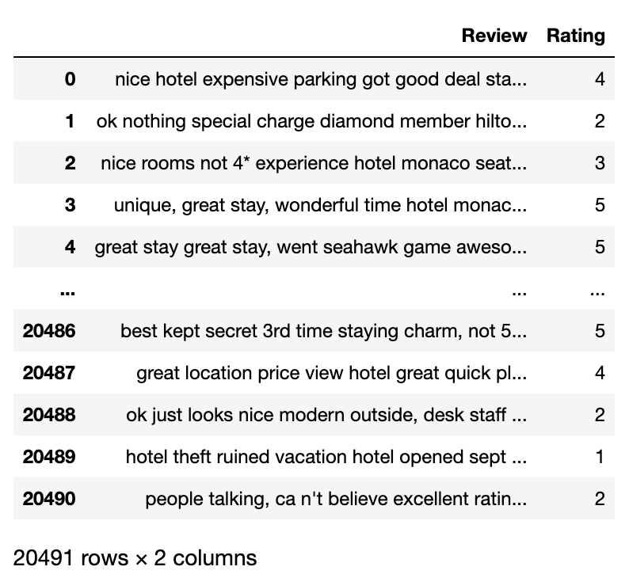

1. 關於資料集
   
   resource: https://www.kaggle.com/datasets/andrewmvd/trip-advisor-hotel-reviews
   
2. 目標: 
   - 生成文字雲
   - 預測評價為正面或負面
   
3. 詞向量方法
   
   > TF-IDF：一種表達**一個字詞對於一個語料庫中的其中一份檔案的重要程度。分數越高表示這個詞只出現於少數幾篇文章，且在這個詞所出現的文章中，它所出現的頻率很高**。 
   
   
tf(term frequency)詞頻：這個詞出現在某篇文章的頻率，也就是**出現次數/總字數**。

idf(inverse document frequency)逆向文件詞頻：詞彙$t$總共在 $d_{t}$ 篇文章中出現過，則詞彙$t$的IDF定義成: $idf_{t} = log({\frac {D} {d_t}})$ $D$:總文章數。
   
   
第$t$個詞彙對於第$d$篇文件的TF-IDF權重定義為 $w_{t,d}=tf_{t,d} \times idf_{t}$

  
